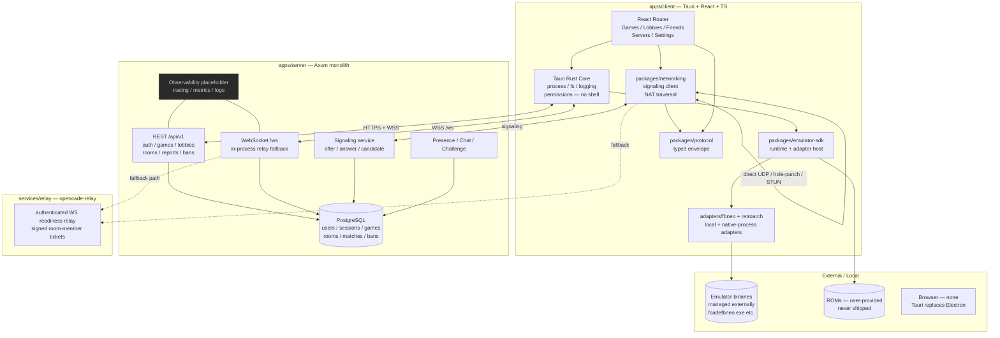

# OpenCade — Architecture

> **Status:** Definitive. This document is the single source of truth for repository layout, system boundaries, and implementation contracts. Anything not described here is not decided.
>
> **Monorepo root:** `D:/OpenCade`  
> **Reference binary (read-only):** `D:/Fightcade` — proprietary installed distribution, `VERSION 2.1.45`. Never copied, never linked, never vendored. See §2 and §17.

---

## Table of Contents

1. [Principles](#1-principles)
2. [Reference System — D:/Fightcade (Read-Only)](#2-reference-system--dfightcade-read-only)
3. [System Diagram](#3-system-diagram)
4. [Repository Tree](#4-repository-tree)
5. [Architecture Decision — B Modular + A + C](#5-architecture-decision--b-modular--a--c)
6. [Client — apps/client (Tauri + React + TypeScript)](#6-client--appsclient-tauri--react--typescript)
7. [Server — apps/server (Axum + PostgreSQL)](#7-server--appsserver-axum--postgresql)
8. [Protocol — packages/protocol](#8-protocol--packagesprotocol)
9. [Database Schema](#9-database-schema)
10. [Networking — packages/networking + services/relay](#10-networking--packagesnetworking--servicesrelay)
11. [Emulator SDK — packages/emulator-sdk + adapters/fbneo](#11-emulator-sdk--packagesemulator-sdk--adaptersfbneo)
12. [Game Definitions — packages/game-definitions](#12-game-definitions--packagesgame-definitions)
13. [Shared — packages/shared](#13-shared--packagesshared)
14. [Security](#14-security)
15. [Observability](#15-observability)
16. [Deployment — docker/](#16-deployment--docker)
17. [Phases M0–M7 — Exit Criteria](#17-phases-m0m7--exit-criteria)
18. [Clean-Room Guardrails](#18-clean-room-guardrails)
19. [Conventions](#19-conventions)

---

## 1. Principles

1. **Correctness first, then maintainability 6 months out.** Boring technology wins.
2. **No proprietary copy.** `D:/Fightcade` is observation only. Every line of OpenCade is original or permissively licensed (Apache-2.0 dependency hygiene).
3. **Single monolith server in MVP.** One Axum process, one Postgres, one deployable. No Redis, no microservices, no premature queue.
4. **Client is native, not a web wrapper.** Tauri replaces Electron/Nativefier. No `shell` exposure, least-privilege permissions, Rust owns process/fs/logging.
5. **Declarative over imperative.** Game support is data (TOML/JSON), not code branches.
6. **Safe process launch by construction.** No shell, no string-concatenated commands, no injection surface.
7. **Versioned protocol from day one.** Every wire message carries `{type, version, request_id, timestamp, payload}`.

---

## 2. Reference System — D:/Fightcade (Read-Only)

`D:/Fightcade` is the installed Fightcade 2 binary distribution (`VERSION.txt` → `2.1.45`). Per PRD §32–33 it is **read-only reference**. Findings below are observations only; no file is copied into `D:/OpenCade`.

### 2.1 Electron / Nativefier wrapper — `fc2-electron/`

| Artifact                                       | Detail                                                                                                                                                                                                                                          |
| ---------------------------------------------- | ----------------------------------------------------------------------------------------------------------------------------------------------------------------------------------------------------------------------------------------------- |
| `fc2-electron/fc2-electron.exe`                | 91 MB distribution binary                                                                                                                                                                                                                       |
| `resources/app/package.json`                   | `electron@8.x`, `electron-context-menu@1.x`, `electron-dl@3.x`; no scripts, no lockfile                                                                                                                                                         |
| `resources/app/nativefier.json`                | Nativefier `8.0.7`, `targetUrl: https://web.fightcade.com/`, `internalUrls: https://replay.fightcade.com`, `singleInstance: true`, `disableDevTools: true`, `disableContextMenu: true`, `width/height: 768`, `tray: true`, `appVersion: 2.1.45` |
| `resources/app/lib/main.js`                    | Webpack-bundled main process (~445 KB, + 365 KB map). Do not hand-patch — re-bundle via Nativefier                                                                                                                                              |
| `resources/app/lib/preload.js`                 | 2.4 KB preload                                                                                                                                                                                                                                  |
| `resources/app/lib/static/login.{html,css,js}` | Minimal IPC login form: `ipcRenderer.send('login-message', [username, password])`                                                                                                                                                               |
| `resources/app/inject/_placeholder`            | Nativefier injection hook (empty)                                                                                                                                                                                                               |

The wrapper is a thin browser around `https://web.fightcade.com`. All lobby/matchmaking state is server-authoritative. Local state is filesystem.

### 2.2 Launcher bridge — `emulator/fcade.exe` + `emulator/frm.exe`

Both are **PyInstaller-frozen Python** (opaque). Evidence: `emulator/fcade-errors.log` traceback `fightcade\launcher.py → fightcade\udp_client.py → timeout` in `start_flycast` / `init_udp`. `Fightcade2.exe` / `Fightcade1.exe` / `fcade-upd.exe` orchestrate auth and spawn these; real netcode/launcher logic lives inside the frozen Python. Not recoverable as source.

### 2.3 Emulator cores — `emulator/`

```
emulator/
  fbneo/           fcadefbneo.exe (+ fcv39.exe),  config/, savestates/, recordings/, fightcade/
                   FBNeo 0.2.97.44 — romset 0.2.97.43/.44 required (FC1 roms fail on FC2)
                   ggponet.dll, kailleraclient.dll
  flycast/         flycast.exe, emu.cfg / emu.default.cfg, mappings/, data/, replays/
  snes9x/          fcadesnes9x.exe, fcadesnes9x.conf, ggponet.dll
  ggpofba/         ggpofba-ng.exe  (legacy)
```

Netcode is C++ GGPO via `ggponet.dll` / `kailleraclient.dll`, not JS async.

### 2.4 The only editable source surface — `emulator/fbneo/fbneo-training-mode/`

Vendored [peon2/fbneo-training-mode](https://github.com/peon2/fbneo-training-mode), **v0.22.10.28**. This is the single directory in `D:/Fightcade` that is original, editable source.

```
fbneo-training-mode/
  fbneo-training-mode.lua   122 KB entry, version header 0.22.10.28
  guipages.lua              30 KB
  tableio.lua               4.4 KB
  games/<rom>/<rom>.lua     ~90 per-game modules (sfiii3/sfiii3.lua, kof98/kof98.lua, …)
  hitboxes/*.lua            cps2-hitboxes.lua, cps3-hitboxes.lua, garou-hitboxes.lua,
                            kof-hitboxes.lua, marvel-hitboxes.lua, … (14 files)
  inputs/input-display.lua, input-modules.lua, scrolling-input/
  addon/addons.lua          79 B registry → loads missions.lua (33 KB)
  resources/{info,replay,stick}/
```

Module contract (the interface OpenCade's adapter may reference as a pattern, not copy):

```lua
-- memory helpers exposed by FBNeo Lua
rb(addr)  rw(addr)  rdw(addr)   -- read byte / word / double-word
wb(addr,val)  ww(addr,val)  wdw(addr,val)  -- write variants
readPlayerOneInputs() / writePlayerOneInputs()  -- per-player I/O
Run()  -- per-frame hook, called every emulated frame
```

Patch point for training features without touching the frozen launcher.

### 2.5 JSON catalogs — `emulator/*.json`

Source of truth for supported games. `fbneo_roms.json` is 727 KB; siblings per system:

```
fbneo_roms.json  fbneo_sms_roms.json  fbneo_nes_roms.json  fbneo_md_roms.json
fbneo_cv_roms.json  fbneo_gg_roms.json  fbneo_msx_roms.json  fbneo_pce_roms.json
fbneo_sg1k_roms.json  fbneo_tg_roms.json  flycast_roms.json  snes9x_roms.json
fc1_roms.json  nulldc_roms.json  fbneo_sms_roms.json  …
```

Shape: `{ "<romId>": { "download": "https://fightcade.download/…/<rom>.zip", "require": ["<parent>"] } }`. The frontend game list and challenge-sound mapping derive from this.

### 2.6 ROM resolution & assets

- User-facing `ROMs/` contains **only shortcuts** (`FBNeo ROMs.lnk`, `Flycast ROMs.lnk`, …) + `ROMs/README.txt`. Real ROMs live at `emulator/<core>/ROMs/<system>/` (e.g. `emulator/fbneo/ROMs/`). Missing `neogeo.zip` BIOS or wrong romset is the common failure.
- `assets/*-challenge.wav` — per-game challenge sounds (`kof98-challenge.wav`, `kof2002-challenge.wav`, `garou-challenge.wav`, `xmvsf-challenge.wav`, … ~26 files) + `fightcade.ico` / `icon-128.png`.

---

## 3. System Diagram



**Data flow:** Client authenticates via REST and opens one room-scoped control WebSocket. Matchmaking creates a room and exchanges host/reflexive candidates. Peers attempt the reserved direct UDP socket first; a failed readiness probe requests a two-minute signed room-member ticket and uses the bounded WebSocket relay. Emulator launch remains local. Standalone FBNeo is local-play only; the experimental RetroArch adapter launches a user-supplied external process whose documented native netplay owns its own data plane.

---

## 4. Repository Tree

```
D:/OpenCade/
├── apps/
│   ├── client/                  # Tauri + React + TypeScript
│   │   ├── src/
│   │   │   ├── routes/          # Games / Lobbies / Friends / Servers / Settings
│   │   │   ├── features/        # per-route feature slices
│   │   │   ├── components/      # design system
│   │   │   ├── stores/          # Zustand (or equivalent) — local UI state
│   │   │   ├── lib/             # protocol client, networking client
│   │   │   └── tauri/           # Tauri command bindings
│   │   ├── src-tauri/
│   │   │   ├── src/             # Rust: process, fs, logging, diagnostics
│   │   │   ├── Cargo.toml
│   │   │   ├── tauri.conf.json  # permissions, no shell
│   │   │   └── capabilities/    # Tauri v2 capability grants
│   │   ├── package.json
│   │   └── vite.config.ts
│   └── server/                  # Axum + PostgreSQL (single monolith)
│       ├── src/
│       │   ├── main.rs
│       │   ├── config.rs
│       │   ├── db/              # sqlx pool, migrations
│       │   ├── routes/          # REST /api/v1/*
│       │   ├── ws/              # /ws handler + in-process relay
│       │   ├── signaling/       # offer/answer/candidate state machine
│       │   ├── auth/            # Argon2id, sessions, middleware
│       │   └── observability/   # placeholder (tracing subscriber)
│       ├── migrations/          # sqlx migrations
│       ├── Cargo.toml
│       └── Dockerfile
├── packages/
│   ├── protocol/                # versioned envelope + typed messages (shared TS + Rust)
│   │   ├── src/
│   │   │   ├── envelope.ts / envelope.rs
│   │   │   ├── messages.ts / messages.rs
│   │   │   └── version.ts
│   │   └── Cargo.toml / package.json
│   ├── emulator-sdk/            # trait + runtime, adapter host, validation, launch
│   │   ├── src/
│   │   │   ├── adapter.ts / adapter.rs  # EmulatorAdapter trait
│   │   │   ├── runtime.ts
│   │   │   ├── validation.ts
│   │   │   └── launch.ts        # safe spawn, no shell
│   │   └── Cargo.toml / package.json
│   ├── game-definitions/        # declarative TOML per game, schema_version=1
│   │   ├── games/
│   │   │   ├── kof98.toml
│   │   │   ├── sfiii3.toml
│   │   │   └── ...
│   │   ├── schema/
│   │   │   └── game.schema.json
│   │   └── Cargo.toml / package.json
│   ├── networking/              # signaling client, NAT traversal, latency
│   │   ├── src/
│   │   │   ├── signaling.ts
│   │   │   ├── nat.ts           # direct UDP / hole-punch / STUN / relay
│   │   │   └── latency.ts       # RTT / loss / jitter
│   │   └── Cargo.toml / package.json
│   └── shared/                  # cross-cutting TS/Rust utilities, result types
│       └── src/
├── adapters/
│   ├── fbneo/                   # local-launch adapter; netplay blocked without a public API
│   └── retroarch/               # user-supplied RetroArch + FBNeo-core native netplay adapter
├── services/
│   └── relay/                   # authenticated, bounded readiness-probe WebSocket relay
│       ├── src/main.rs
│       ├── Cargo.toml
│       └── Dockerfile
├── research/                    # NOT SHIPPED — observations, protocol notes, binaries
│   ├── observations/
│   ├── protocol/
│   ├── binaries/
│   ├── network/
│   ├── behavior/
│   └── notes/
├── docs/
│   ├── ARCHITECTURE.md          # this file
│   └── ...
├── tests/                       # cross-package integration tests
├── docker/
│   ├── docker-compose.yml
│   └── postgres/
│       └── init.sql
└── Cargo.toml                   # workspace root
    pnpm-workspace.yaml
    package.json
```

All paths are relative to `D:/OpenCade`. No file from `D:/Fightcade` appears in this tree.

---

## 5. Architecture Decision — B Modular + A + C

**Winner: B-Modular grafted with A and C.**

- **B (modular monorepo)** provides the package boundaries (`protocol`, `emulator-sdk`, `game-definitions`, `networking`, `shared`, `adapters/fbneo`) and the `apps/*` / `services/*` split. This is the dominant structure.
- **Graft A (single Axum control plane, Postgres-only)** constrains the server: one control-plane
  deployable (`apps/server`), one database (PostgreSQL), and no Redis in MVP.
- **Graft C (Docker Compose, observability shell, bounded relay)** adds the deployment and
  operational shell: `docker-compose.yml` runs the database, control plane, and a separate
  authenticated WebSocket readiness relay. The relay is deliberately not represented as TURN.

Consequences:

- MVP has **three active containers**: `db` (`postgres:16-alpine`), `opencade-server` on `8080`,
  and `opencade-relay` on `8081`; peers still prefer direct UDP.
- No Redis, no separate signaling service, and no message queue in MVP. Presence remains in the
  control plane; bounded readiness frames alone can use the relay fallback.
- The relay accepts only short-lived room-member tickets issued by the control plane, limits rooms
  to two users and bounded frames, and does not relay RetroArch's native netplay socket.

---

## 6. Client — apps/client (Tauri + React + TypeScript)

Tauri replaces the Electron 8 + Nativefier 8.0.7 wrapper entirely. The web content is a real SPA (React + TypeScript + Vite), not a remote URL.

### 6.1 Tauri responsibilities (Rust layer — `src-tauri/src/`)

| Concern            | Implementation                                                                                                                                                                                                  |
| ------------------ | --------------------------------------------------------------------------------------------------------------------------------------------------------------------------------------------------------------- |
| **Process launch** | `std::process::Command` with explicit `arg` list, no `shell`, no string interpolation. `Command::new(path).args(sanitizedArgs)` only. Path is validated against an allow-list (adapter-provided binary).        |
| **Filesystem**     | Scoped FS via `tauri-plugin-fs` with capability grants. Allowed: read `emulator/<core>/ROMs/**`, read/write `config/**`, `savestates/**`, logs. Denied: everything else by default.                             |
| **Logging**        | `tauri-plugin-log` → rotating file in OS log dir + console. Structured fields: `request_id`, `room_id`, `adapter`.                                                                                              |
| **Permissions**    | `tauri.conf.json` + `capabilities/` — minimal `shell` (only `shell.open` true, `shell.all` false). No `http` to arbitrary hosts — only `https://<configured-server>/api/v1` and `wss://<configured-server>/ws`. |
| **Diagnostics**    | Commands: `diagnose_roms`, `diagnose_network`, `diagnose_adapter`, `get_logs`. Each returns a serializable report (see §6.4).                                                                                   |
| **Updates**        | `tauri-plugin-updater` (placeholder, disabled in MVP dev).                                                                                                                                                      |
| **Security**       | CSP in `tauri.conf.json`, `dangerousUseHttpScheme` off, `withGlobalTauri` off in production.                                                                                                                    |

> **No shell, no injection.** Every emulator launch goes through `packages/emulator-sdk` `launch()` which escapes/validates before reaching `Command`. See §11.

### 6.2 Routes (React Router)

```
/                    → redirect to /games
/games               → Game browser (catalog from game-definitions + local scan status)
/games/:id           → Game detail — ROM status, required files, launch
/lobbies             → Lobby list (server-authoritative)
/lobbies/:id         → Lobby detail — members, chat, challenge button
/friends             → Friends list, presence, invites
/servers             → Server picker, latency, region
/settings            → Emulator paths, ROM dirs, keybinds, diagnostics, logs
/diagnostics         → Network test, adapter test, ROM validation report
```

Each route is a feature slice (`src/features/<route>/`) with its own query hooks, not a global store dump.

### 6.3 Adapter integration

```
UI  --(invoke)-->  Tauri command  --(call)-->  emulator-sdk runtime
                                              --(dispatch)--> adapters/fbneo
                                              --(validate)--> game-definitions
                                              --(scan)------> local FS (allowed dirs)
                                              --(spawn)-----> Command (no shell)
```

- `packages/emulator-sdk` exposes `getAdapter(emulator: string)` → `EmulatorAdapter`.
- `packages/game-definitions` provides the declarative `GameDefinition` for the `gameId`; the adapter's `validate()` checks `required_files` against the local scan.
- Launch args are rendered from the TOML template with `{rom}` substitution and per-arg escaping, never via shell.

### 6.4 Diagnostics

Commands exposed to the UI (and to `Network Test`):

- `diagnose_roms { gameId? }` → `{ gameId, present: bool, missing: string[], bios: { present: bool, path } }`
- `diagnose_adapter { emulator: "fbneo" }` → `{ detected: bool, version: string|null, path: string|null, error: string|null }`
- `diagnose_network` → `{ natType, rttMs: { p50, p95 }, loss, jitterMs, relayReachable: bool }` (see §10)
- `get_logs { lines: number }` → `{ path: string, lines: string[] }`

All diagnostics are read-only and never expose credentials or full filesystem paths outside the allowed scope.

---

## 7. Server — apps/server (Axum + PostgreSQL)

Single Axum monolith. No Redis in MVP. WS relay lives in-process.

### 7.1 REST — `REST /api/v1`

Base: `https://<host>/api/v1`. JSON, `Content-Type: application/json`. Auth via `Authorization: Bearer <token>` (opaque session token; see §14).

| Method | Path               | Auth  | Description                                                                                          |
| ------ | ------------------ | ----- | ---------------------------------------------------------------------------------------------------- |
| `POST` | `/auth/register`   | no    | Create account. Body `{ username, password, email? }` → `201 { user, token }`                        |
| `POST` | `/auth/login`      | no    | Body `{ username, password }` → `{ user, token }`. Sets `Set-Cookie` alternative for browser clients |
| `POST` | `/auth/logout`     | yes   | Invalidate current session                                                                           |
| `GET`  | `/auth/me`         | yes   | Current user profile                                                                                 |
| `GET`  | `/games`           | yes   | List games (from `games` + `game_versions`)                                                          |
| `GET`  | `/games/:id`       | yes   | Game detail + versions                                                                               |
| `GET`  | `/servers`         | yes   | List relay/region servers (from `servers` table)                                                     |
| `GET`  | `/lobbies`         | yes   | List lobbies (filtered by `gameId?`)                                                                 |
| `POST` | `/lobbies`         | yes   | Create lobby `{ gameId, name, maxPlayers }`                                                          |
| `GET`  | `/lobbies/:id`     | yes   | Lobby detail + members                                                                               |
| `POST` | `/rooms`           | yes   | Create room (match) `{ gameId, serverId? }`                                                          |
| `GET`  | `/rooms/:id`       | yes   | Room detail + state                                                                                  |
| `POST` | `/rooms/:id/join`  | yes   | Join room                                                                                            |
| `POST` | `/rooms/:id/leave` | yes   | Leave room                                                                                           |
| `POST` | `/reports`         | yes   | Report user/room `{ targetUserId, reason }`                                                          |
| `GET`  | `/reports`         | admin | List reports                                                                                         |
| `POST` | `/bans`            | admin | Ban user                                                                                             |

All handlers: `axum::extract::State<AppState>` with `sqlx::PgPool`, validated with `serde` + `validator`, errors as `application/problem+json`.

### 7.2 WebSocket — `WSS /ws`

Single endpoint `wss://<host>/ws`. Auth via query `?token=<session>` on upgrade (also accepts `Authorization` header where the WS client can set it). One WS per authenticated user.

Every frame is a **versioned envelope** (see §8):

```json
{
  "type": "presence.update",
  "version": "1.0",
  "request_id": "01H...",
  "timestamp": "2026-08-22T00:00:00.000Z",
  "payload": { "status": "online", "gameId": "kof98" }
}
```

Server-to-client pushes use the same envelope (server generates `request_id`). Client correlates replies by `request_id`.

Message types (MVP):

| `type`                | Direction | Payload                                                                            |
| --------------------- | --------- | ---------------------------------------------------------------------------------- |
| `presence.update`     | `C↔S`     | `{ status: "online"\|"away"\|"in-game", gameId?: string }`                         |
| `chat.message`        | `C↔S`     | `{ roomId \| lobbyId, body: string }` — server fans out to room/lobby members      |
| `challenge.create`    | `C→S`     | `{ targetUserId, gameId, roomId? }`                                                |
| `challenge.accept`    | `C→S`     | `{ challengeId }`                                                                  |
| `challenge.decline`   | `C→S`     | `{ challengeId }`                                                                  |
| `challenge.cancel`    | `C→S`     | `{ challengeId }`                                                                  |
| `signaling.offer`     | `C↔S`     | `{ roomId, sdp: string }` — server relays to peer(s) in room                       |
| `signaling.answer`    | `C↔S`     | `{ roomId, sdp: string }`                                                          |
| `signaling.candidate` | `C↔S`     | `{ roomId, candidate: string, sdpMid: string\|null, sdpMLineIndex: number\|null }` |
| `room.state`          | `S→C`     | `{ roomId, state: RoomState, members: string[] }`                                  |
| `error`               | `S→C`     | `{ code: string, message: string, request_id?: string }`                           |

In MVP the WS handler **is the relay fallback**: if two peers cannot establish direct UDP, they keep the WS open and the server forwards `signaling.*` and (optionally) game data as a last resort. This is in-process (`apps/server/src/ws/relay.rs`); `services/relay` will take over when promoted.

Heartbeat: client pings every 20s (`{type:"ping"}`), server replies `pong`; missed 2 pongs → reconnect with exponential backoff.

### 7.3 Room state machine

```
WAITING ──(host creates)──► WAITING
WAITING|CHALLENGING ──(challenge accepted)──► CONNECTING
CONNECTING ──(both authorized native processes launch)──► PLAYING
PLAYING ──(both native processes exit)──────────────────► FINISHED
CONNECTING ──(a launched process exits before peer)─────► CANCELLED
*       ──(host cancels / timeout / all leave)──► CANCELLED
```

States stored in `rooms.state` (`WAITING | READY | CHALLENGING | CONNECTING | PLAYING | FINISHED |
CANCELLED`). Alpha rooms have exactly two members. Transitions are server-authoritative and backed by
per-participant native launch/exit records; a successful UDP readiness probe never advances room
state. Native launch descriptors are derived from short-lived, hashed, one-use server grants. See
ADR 0004.

Challenge flow: `challenge.create` → server creates `challenge` row (ephemeral, in `rooms` or separate `challenges` if needed) → pushes `challenge.create` to target → target `challenge.accept/decline` → on accept, server creates/moves to `room` and emits `room.state: READY`.

---

## 8. Protocol — packages/protocol

Shared crate (Rust) + package (TS) from the same schema. Single version number.

### 8.1 Envelope

Every WS frame and every REST error body that needs correlation uses:

```ts
// packages/protocol/src/envelope.ts  — mirrored in src/envelope.rs
type Envelope<T extends string, P> = {
  type: T; // e.g. "signaling.offer"
  version: number; // 1 — bump on breaking change
  request_id: string; // ULID — client-generated for C→S, server-generated for S→C pushes
  timestamp: string; // ISO-8601 UTC — Date.toISOString() / chrono::Utc
  payload: P;
};
```

```rust
// packages/protocol/src/lib.rs — canonical envelope (authoritative)
#[derive(Serialize, Deserialize)]
pub struct Envelope<T = Value> {
    #[serde(rename = "type")]
    pub msg_type: String,
    pub version: String, // "1.0" canonical, "1" compat via is_supported_version
    pub request_id: String,
    pub timestamp: DateTime<Utc>,
    pub payload: T,
}
pub const PROTOCOL_VERSION: &str = "1.0";
pub fn is_supported_version(v: &str) -> bool { v == "1.0" || v == "1" }
```

Rules: `version` is `"1.0"` canonical for all messages in MVP (compat `"1"` accepted). Unknown `type` → `error { code:"unknown_type" }`. Unknown `version` → `error { code:"version_unsupported" }`. `request_id` is echoed in errors so clients can correlate.

### 8.2 Versioning

- `packages/protocol/src/lib.rs` exports `pub const PROTOCOL_VERSION: &str = "1.0"` and `pub fn is_supported_version(v:&str)->bool` (accepts `"1.0"` and `"1"`).
- Server accepts `version: "1.0"` (compat `"1"`); higher versions get `version_unsupported` (`is_supported_version` returns false).
- Additive fields inside `payload` are allowed (clients ignore unknown keys). Breaking renames require a version bump to `"2.0"` and a migration window.

---

## 9. Database Schema

PostgreSQL only. Migrations in `apps/server/migrations/*.sql`, managed by `sqlx::migrate`.

```sql
-- users — Argon2id password hash, no plaintext ever
CREATE TABLE users (
  id            UUID PRIMARY KEY DEFAULT gen_random_uuid(),
  username      TEXT NOT NULL UNIQUE CHECK (char_length(username) BETWEEN 2 AND 32),
  email         TEXT UNIQUE,
  password_hash TEXT NOT NULL,              -- Argon2id
  created_at    TIMESTAMPTZ NOT NULL DEFAULT now(),
  updated_at    TIMESTAMPTZ NOT NULL DEFAULT now()
);

-- sessions — opaque bearer tokens (hashed at rest)
CREATE TABLE sessions (
  id            UUID PRIMARY KEY DEFAULT gen_random_uuid(),
  user_id       UUID NOT NULL REFERENCES users(id) ON DELETE CASCADE,
  token_hash    TEXT NOT NULL UNIQUE,       -- SHA-256 of token
  created_at    TIMESTAMPTZ NOT NULL DEFAULT now(),
  expires_at    TIMESTAMPTZ NOT NULL,
  revoked_at    TIMESTAMPTZ
);
CREATE INDEX ON sessions(user_id);
CREATE INDEX ON sessions(expires_at);

-- games — canonical game list (from game-definitions at seed time)
CREATE TABLE games (
  id            TEXT PRIMARY KEY,           -- e.g. "kof98" — matches TOML id
  name          TEXT NOT NULL,              -- "The King of Fighters '98"
  emulator      TEXT NOT NULL,              -- "fbneo" | "flycast" | "snes9x"
  created_at    TIMESTAMPTZ NOT NULL DEFAULT now()
);

-- game_versions — romset / version rows per game
CREATE TABLE game_versions (
  id            UUID PRIMARY KEY DEFAULT gen_random_uuid(),
  game_id       TEXT NOT NULL REFERENCES games(id) ON DELETE CASCADE,
  version       TEXT NOT NULL,              -- e.g. "0.2.97.44"
  is_default    BOOLEAN NOT NULL DEFAULT false,
  created_at    TIMESTAMPTZ NOT NULL DEFAULT now(),
  UNIQUE(game_id, version)
);

-- servers — region / relay servers
CREATE TABLE servers (
  id            UUID PRIMARY KEY DEFAULT gen_random_uuid(),
  name          TEXT NOT NULL,
  region        TEXT NOT NULL,              -- "us-east" | "eu-west" | …
  host          TEXT NOT NULL,
  port          INT  NOT NULL,
  created_at    TIMESTAMPTZ NOT NULL DEFAULT now()
);

-- rooms — match rooms, server-authoritative state
CREATE TABLE rooms (
  id            UUID PRIMARY KEY DEFAULT gen_random_uuid(),
  game_id       TEXT NOT NULL REFERENCES games(id),
  server_id     UUID REFERENCES servers(id),
  host_user_id  UUID NOT NULL REFERENCES users(id),
  state         TEXT NOT NULL CHECK (state IN ('WAITING','READY','PLAYING','FINISHED','CANCELLED')),
  max_players   INT  NOT NULL DEFAULT 2 CHECK (max_players BETWEEN 2 AND 4),
  created_at    TIMESTAMPTZ NOT NULL DEFAULT now(),
  updated_at    TIMESTAMPTZ NOT NULL DEFAULT now()
);
CREATE INDEX ON rooms(game_id, state);
CREATE INDEX ON rooms(host_user_id);

-- room_members — join table
CREATE TABLE room_members (
  room_id       UUID NOT NULL REFERENCES rooms(id) ON DELETE CASCADE,
  user_id       UUID NOT NULL REFERENCES users(id) ON DELETE CASCADE,
  joined_at     TIMESTAMPTZ NOT NULL DEFAULT now(),
  PRIMARY KEY (room_id, user_id)
);

-- matches — finished play sessions (for history / replay linkage later)
CREATE TABLE matches (
  id            UUID PRIMARY KEY DEFAULT gen_random_uuid(),
  room_id       UUID NOT NULL REFERENCES rooms(id),
  game_id       TEXT NOT NULL REFERENCES games(id),
  started_at    TIMESTAMPTZ NOT NULL,
  ended_at      TIMESTAMPTZ,
  created_at    TIMESTAMPTZ NOT NULL DEFAULT now()
);

-- reports — user reports
CREATE TABLE reports (
  id            UUID PRIMARY KEY DEFAULT gen_random_uuid(),
  reporter_id   UUID NOT NULL REFERENCES users(id),
  target_user_id UUID REFERENCES users(id),
  room_id       UUID REFERENCES rooms(id),
  reason        TEXT NOT NULL,
  created_at    TIMESTAMPTZ NOT NULL DEFAULT now()
);

-- bans — admin bans
CREATE TABLE bans (
  id            UUID PRIMARY KEY DEFAULT gen_random_uuid(),
  user_id       UUID NOT NULL REFERENCES users(id) ON DELETE CASCADE,
  reason        TEXT NOT NULL,
  banned_by     UUID NOT NULL REFERENCES users(id),
  expires_at    TIMESTAMPTZ,
  created_at    TIMESTAMPTZ NOT NULL DEFAULT now()
);
CREATE INDEX ON bans(user_id, expires_at);
```

Seed: `games` + `game_versions` are seeded from `packages/game-definitions/games/*.toml` at migration/seed time. No manual SQL for game list.

---

## 10. Networking — packages/networking + services/relay

### 10.1 Signaling

Signaling is **server-relayed, versioned, and room-scoped**. Clients never exchange SDP directly.

```
Peer A                          Server (/ws)                         Peer B
  |  signaling.offer {roomId, sdp}  ─────► | ─────►  signaling.offer   |
  |                                 relay  |                            |
  |  ◄──────────────── signaling.answer ─── | ◄──── signaling.answer ─── |
  |  signaling.candidate ───────────────►   | ─────►  candidate         |
  |  ◄──────────────── candidate ────────── | ◄──── candidate ────────── |
```

All three types carry `envelope.version = 1` and are validated: `roomId` must exist, sender must be a `room_members` row, `sdp`/`candidate` are opaque strings (length-capped, no execution).

### 10.2 NAT traversal — host/reflexive candidates and UDP hole punching

`packages/networking/src/{stun,traversal}.rs` implements the current direct path:

1. Reserve one UDP socket before signaling.
2. If configured, send an RFC 8489 Binding request from that same socket to learn its reflexive
   address.
3. Exchange host/reflexive candidates and a nonce through the authenticated room WebSocket.
4. Send room/session-bound punch packets to at most eight candidates, 3 attempts and 500 ms
   apart. Accept only a known source with matching credentials, then connect the reserved socket.

A single Binding server cannot honestly distinguish cone from symmetric behavior. Diagnostics and
reports therefore use `unknown | open | mapped | blocked`: `open` means the reflexive address equals
the advertised host address, while `mapped` only proves translation occurred. RFC 5780 behavior
discovery remains deferred. Authenticated WebSocket readiness-probe relay fallback is implemented,
but it is not considered physically proven until the campaign in `docs/alpha/LAN_TEST.md` passes.

### 10.3 Authenticated readiness relay

An active room member requests `POST /api/v1/rooms/:id/relay-ticket`. The server issues a
HMAC-SHA256 capability valid for two minutes. `opencade-relay` verifies the signature and expiry,
fixes the connection to the signed room/user, permits at most two distinct users, uses bounded
64-message queues, and rejects frames above 64 KiB. Text frames must be valid versioned envelopes
whose payload room matches the signed room; bounded binary probe frames remain opaque.

This relay carries OpenCade readiness frames. It is not TURN and does not relay RetroArch's native
TCP netplay connection.

### 10.4 Latency — RTT / loss / jitter

`packages/networking/src/latency.ts`:

- **RTT**: WS ping/pong round-trip (client `ping` envelope → server `pong`), EWMA `alpha=0.2`, reported as `p50/p95` over last 30 samples.
- **Loss**: sequence-numbered heartbeats; `lost / sent` over 30s window.
- **Jitter**: `stddev` of inter-arrival times for heartbeats.

Exposed via `diagnose_network` Tauri command and rendered in `/servers` and `/diagnostics`.

---

## 11. Emulator SDK — packages/emulator-sdk + adapters/fbneo + adapters/retroarch

### 11.1 Trait — `EmulatorAdapter`

The synchronous adapter trait owns detection, validation, safe local launch, optional match
preparation, native-process match launch, and shutdown. `AdapterCapabilities` makes the netplay data
plane explicit: `OpenCadeFrames`, `NativeProcess`, or `BlockedNoPublicInterface`. A successful local
launch can therefore never be mistaken for netplay support.

### 11.2 Safe launch

```rust
// packages/emulator-sdk/src/launch.rs — no shell, no interpolation
pub fn build_command(adapter: &dyn EmulatorAdapter, ctx: &LaunchContext) -> Command {
    let mut cmd = Command::new(&ctx.adapter_path); // validated path, not user input
    for arg in render_args(&ctx.game.launch.args, &ctx.rom_path) {
        cmd.arg(sanitize_arg(&arg)); // reject arg containing \0, control chars
    }
    cmd.stdout(Stdio::null()).stderr(Stdio::piped());
    cmd
}
```

Rules: `Command::new(path).args(args)` — never `sh -c`, never `format!("{} {}", bin, args)`. `sanitize_arg` rejects `--` escapes that would be interpreted as flags by the emulator. ROM path is canonicalized and must be inside an allowed ROM dir.

### 11.3 adapters/fbneo — first adapter

Implements `EmulatorAdapter` for `emulator/fbneo/fcadefbneo.exe` (FBNeo 0.2.97.44). Responsibilities:

- `detect` — probes `emulator/fbneo/fcadefbneo.exe` then user-configured path.
- `validate` — checks `required_files` from the game's TOML against `emulator/fbneo/ROMs/<system>/` (bios `neogeo.zip` etc.).
- `getSupportedGames` — enumerated from `packages/game-definitions/games/*.toml` where `emulator = "fbneo"`.
- `launch` — renders `launch.args` template, validates ROM presence, spawns via `build_command`.

Future adapters (`flycast`, `snes9x`) implement the same trait; no SDK change required.

### 11.4 adapters/retroarch — experimental Proof of Play

The RetroArch adapter requires a user-supplied executable, FBNeo Libretro core, and ROM below one
configured root. It constructs documented host/guest arguments without a shell and computes SHA-256
fingerprints for the executable, core, and content. See ADR 0003. CI never redistributes emulator
software, and the adapter remains experimental until `docs/alpha/RETROARCH_TEST.md` passes on two
physical Windows machines.

---

## 12. Game Definitions — packages/game-definitions

Declarative, data-driven. One TOML per game, `schema_version = 1`.

### 12.1 Schema

```toml
# packages/game-definitions/games/kof98.toml
schema_version = 1
id = "kof98"
name = "The King of Fighters '98"
emulator = "fbneo"                 # fbneo | flycast | snes9x

[launch]
args = ["-rom", "{rom}", "-window"]  # {rom} substituted with canonical ROM path

[validation]
required_files = ["kof98.zip", "neogeo.zip"]
bios = "neogeo.zip"                # optional, for diagnostics grouping

[metadata]
year = 1998
developer = "SNK"
players = 2
```

```json
// packages/game-definitions/schema/game.schema.json — JSON Schema for validation
{
  "$schema": "http://json-schema.org/draft-07/schema#",
  "type": "object",
  "required": ["schema_version", "id", "name", "emulator"],
  "properties": {
    "schema_version": { "type": "integer", "const": 1 },
    "id": { "type": "string", "pattern": "^[a-z0-9_-]+$" },
    "name": { "type": "string", "minLength": 1 },
    "emulator": { "type": "string", "enum": ["fbneo", "flycast", "snes9x"] },
    "launch": {
      "type": "object",
      "required": ["args"],
      "properties": { "args": { "type": "array", "items": { "type": "string" } } }
    },
    "validation": {
      "type": "object",
      "properties": {
        "required_files": { "type": "array", "items": { "type": "string" } },
        "bios": { "type": "string" }
      }
    }
  }
}
```

### 12.2 Local scan detection

At startup (and on Settings → Rescan) the client walks allowed ROM dirs, builds a `Set<filename>`, and marks each `GameDefinition` as `present | missing(missingFiles)` by intersecting `required_files`. No ROM is ever shipped with the repo.

### 12.3 Catalog relationship

`D:/Fightcade`'s `fbneo_roms.json` (727 KB) is the _observation_ that informs which TOML files to create. The TOML set is hand-authored original data; it does not copy the JSON file.

---

## 13. Shared — packages/shared

Cross-cutting utilities used by both Rust and TS:

- `Result<T, E>` helpers, `ULID` generation, `ISO-8601` formatting.
- `RoomState` enum, `EmulatorId` branded type.
- Validation helpers (`isValidUsername`, `isValidRoomName`).
- No business logic; no I/O.

---

## 14. Security

| Concern               | Decision                                                                                                                                                                                             |
| --------------------- | ---------------------------------------------------------------------------------------------------------------------------------------------------------------------------------------------------- |
| **Password hashing**  | Argon2id (`argon2` crate, `m=19456, t=2, p=1`). `password_hash` column only.                                                                                                                         |
| **Sessions**          | Opaque 32-byte random token, `SHA-256` hashed at rest (`token_hash`). Sent as `Bearer` header and `HttpOnly; Secure; SameSite=Lax` cookie alternative. `expires_at` 30 days, sliding refresh on use. |
| **Auth middleware**   | Axum extractor `AuthUser` — validates token, checks `revoked_at`, `expires_at`, loads `users` row. Fails → `401 { code:"unauthorized" }`.                                                            |
| **Input validation**  | `validator` crate on every REST body; length caps on WS `sdp`/`candidate` (16 KB), `chat.body` (2 KB), `username` (32 chars).                                                                        |
| **Process launch**    | No shell, allow-listed binary path, per-arg sanitization, ROM path canonicalization inside allowed dirs (see §11.2).                                                                                 |
| **Tauri permissions** | No `shell` plugin, scoped `fs` (allow `emulator/**`, `config/**`, logs; deny rest), CSP, `withGlobalTauri: false`.                                                                                   |
| **CORS**              | `Access-Control-Allow-Origin` limited to Tauri's custom protocol + `http://localhost:1420` in dev only.                                                                                              |
| **Rate limiting**     | `tower::limit` on `/auth/*` (5/min/IP) and WS `signaling.*` (60/min/user) — in-memory in MVP, no Redis.                                                                                              |
| **Secrets**           | `.env` never committed; `DATABASE_URL`, `JWT_SECRET` (if used for signing, not for sessions) loaded via `dotenvy`. CI uses GitHub secrets.                                                           |

---

## 15. Observability

Placeholder in MVP, real wiring without re-architecture.

- **Logging**: `tracing` + `tracing-subscriber` (JSON in prod, pretty in dev). Every request logs `request_id`, `user_id`, `route`, `latency_ms`. Tauri side uses `tauri-plugin-log`.
- **Metrics**: `prometheus` exporter at `GET /metrics` (behind admin auth) — counters `http_requests_total`, `ws_connections`, `rooms_created`, histogram `http_request_duration_seconds`.
- **Tracing**: `tracing-opentelemetry` stub — exporter disabled in MVP, enabled by setting `OTEL_EXPORTER_OTLP_ENDPOINT`.
- **Health**: `GET /health` → `{ status:"ok", version, db:"up"|"down" }` (no auth, for Compose healthcheck).
- All observability code is gated behind `observability/` module so it can be no-op in tests.

---

## 16. Deployment — docker-compose.yml

### 16.1 docker-compose.yml (root)

Canonical compose is `docker-compose.yml` at repo root. Active services are PostgreSQL,
`opencade-server` on `8080`, and the authenticated WebSocket readiness relay on `8081`. The server
and relay receive the same independently generated `RELAY_AUTH_SECRET`; it must differ from the
session secret.

```yaml
# docker-compose.yml — active
name: opencade
services:
  db:
    image: postgres:16-alpine
    environment:
      POSTGRES_USER: opencade
      POSTGRES_PASSWORD: opencade
      POSTGRES_DB: opencade
    ports: ["5432:5432"]
    volumes:
      - pgdata:/var/lib/postgresql/data
    healthcheck:
      test: ["CMD-SHELL", "pg_isready -U opencade -d opencade"]
      interval: 5s
      retries: 10

  opencade-server:
    build:
      context: .
      dockerfile: ./apps/server/Dockerfile
    environment:
      DATABASE_URL: postgres://opencade:opencade@db:5432/opencade
      RUST_LOG: info
      PORT: 8080
    ports: ["8080:8080"]
    depends_on:
      db: { condition: service_healthy }
    healthcheck:
      test: ["CMD-SHELL", "wget -qO- http://localhost:8080/health || exit 1"]

  relay:
    image: opencade-relay:local
    environment:
      RELAY_AUTH_SECRET: ${RELAY_AUTH_SECRET}
    ports: ["8081:8081"]

volumes:
  pgdata:
```

The relay is a WebSocket service, not a STUN or TURN listener. STUN remains an independently
configured RFC 8489 service.

### 16.2 Dockerfiles

- `apps/server/Dockerfile` — `rust:1.98-bookworm` builder → `debian:bookworm-slim` runtime, `sqlx migrate run` on start.
- `services/relay/Dockerfile` — same pattern, binary `opencade-relay`.

No `docker-compose.override.yml` in repo; devs create it locally if needed.

---

## 17. Phases M0–M7 — Exit Criteria

| Phase  | Name                    | Exit Criteria                                                                                                                                                                                                                                                                                                                |
| ------ | ----------------------- | ---------------------------------------------------------------------------------------------------------------------------------------------------------------------------------------------------------------------------------------------------------------------------------------------------------------------------- |
| **M0** | Bootstrap               | Monorepo builds (`cargo check`, `pnpm build`), `docker compose up` brings `postgres` + `opencade-server` (empty), `GET /health` returns `ok`, `research/` exists and is gitignored from shipping artifacts.                                                                                                                  |
| **M1** | Protocol & DB           | `packages/protocol` envelope round-trips Rust↔TS, migrations create all tables in §9, seed from `game-definitions` inserts ≥1 game, `cargo test` + `pnpm test` pass.                                                                                                                                                         |
| **M2** | Auth & REST             | `POST /auth/register`, `/login`, `/logout`, `GET /auth/me` work with Argon2id + opaque sessions, `GET /games`, `/servers`, `/lobbies` return seeded data, auth middleware rejects unauthenticated calls with `401`, rate limiting enforced.                                                                                  |
| **M3** | Client shell            | Tauri app launches, React Router renders all routes in §6.2 with mocked data, `tauri.conf.json` has no `shell` permission, `diagnose_*` commands return stub reports, `pnpm tauri dev` works on Windows.                                                                                                                     |
| **M4** | Emulator SDK + FBNeo    | `EmulatorAdapter` trait implemented for `fbneo`, `detect` finds `fcadefbneo.exe`, `validate` reports missing `neogeo.zip` correctly, `launch` spawns with no shell and per-arg escaping, `game-definitions` TOML `schema_version=1` validates, local scan marks games present/missing, safe-launch tests prove no injection. |
| **M5** | Networking & Relay      | WS `/ws` envelope works end-to-end, room membership scopes signaling, the room state machine holds under concurrent joins, direct UDP/STUN/hole-punching and signed-ticket relay fallback pass automated tests, `diagnose_network` reports `rtt/loss/jitter`, and physical results remain evidence-gated.                    |
| **M6** | Lobbies, Presence, Chat | Presence `online/away/in-game` broadcasts, `chat.message` fans out to room/lobby, `challenge.create/accept/decline/cancel` flow creates a `READY` room on accept, `reports` + `bans` enforced (banned user gets `403`), end-to-end challenge→room→signaling demo with two clients.                                           |
| **M7** | Hardening & Ship        | `docker compose up --build` from clean clone, `tracing` JSON logs + `/metrics` + `/health`, `tauri-plugin-log` rotation, no secret in repo, `research/` excluded from `cargo package`/`tauri build`, load test: 100 concurrent WS, 20 rooms, p95 REST < 100 ms, docs complete, `CHANGELOG.md` cut.                           |

No phase is considered done until its exit criteria are demonstrated on a clean machine (`git clone` → `docker compose up` → `pnpm tauri dev`).

---

## 18. Clean-Room Guardrails

`D:/Fightcade` is proprietary. `research/` is not shipped. Every implementation line is original.

### 18.1 Pipeline — Observation → Documentation → Design → Implementation

1. **Observation** — run the installed binary, capture behavior in `research/observations/*.md` (what it does, not how). No disassembly, no decompilation.
2. **Documentation** — distill observations into `research/protocol/*.md`, `research/behavior/*.md`, `research/network/*.md` as plain-English specs.
3. **Design** — write a design doc in `docs/` or a crate's `README.md` that references only the documentation, not the binary.
4. **Implementation** — code from the design doc. No binary open while coding.

A commit that implements a feature must not contain `research/` changes and must reference the design doc, not an observation.

### 18.2 Forbidden vs Allowed

| Forbidden (never in repo)                                                                    | Allowed                                                                 |
| -------------------------------------------------------------------------------------------- | ----------------------------------------------------------------------- |
| `fcade.exe`, `frm.exe`, `fcadefbneo.exe`, `flycast.exe`, `ggponet.dll`, `kailleraclient.dll` | Original Rust/TS code, `Cargo.toml`/`package.json` with permissive deps |
| Any `*.zip` ROM, `neogeo.zip` BIOS, `assets/*-challenge.wav`                                 | `packages/game-definitions/games/*.toml` (original declarative data)    |
| Credentials, session tokens, `fightcade/` replays                                            | Public specs (GGPO, WebSocket, STUN/TURN RFCs)                          |
| Decompiled `launcher.py` / `udp_client.py` source, `lib/main.js` bundle text                 | Docs that describe behavior in own words                                |
| `D:/Fightcade` paths in code or comments                                                     | `research/` notes (gitignored from publish)                             |

### 18.3 Dependency hygiene

- License allow-list: `Apache-2.0`, `MIT`, `BSD`, `ISC`, `Unicode-DFS-2016`. `GPL`/`AGPL` require explicit approval.
- `cargo deny` + `pnpm licenses` in CI.
- `research/` is excluded from `cargo package`, `tauri build`, and Docker build contexts via `.dockerignore`.

### 18.4 research/ layout (not shipped)

```
research/
  observations/   # raw notes from running D:/Fightcade — what, not how
  protocol/       # distilled message flows, state machines
  binaries/       # hashes, file lists, version strings — never the binaries
  network/        # packet captures described, not dumped
  behavior/       # lobby/room/chat behavior specs
  notes/          # scratch, TODO, questions
```

`research/` is `.gitignore`'d from release artifacts but tracked in dev for auditability. CI asserts no file from `research/` appears in `apps/server` or `apps/client` builds.

---

## 19. Conventions

- **Formatting**: `rustfmt` + `clippy -- -D warnings` (Rust), `prettier` + `eslint` (TS). No custom style.
- **Commits**: Conventional Commits (`feat:`, `fix:`, `docs:`, `chore:`). No `Co-Authored-By` trailers.
- **Errors**: Rust `thiserror` + `anyhow` at boundaries; TS `Result<T, E>` via `neverthrow` or equivalent. Never `unwrap()` on user input.
- **Testing**: `cargo test` (unit + `sqlx` integration with `#[sqlx::test]`), `vitest` (client), `playwright` for critical flows (login → lobby → challenge) — emulators mocked, no binary in CI.
- **Config**: `dotenvy` for server, `tauri.conf.json` for client. No hardcoded URLs; `VITE_SERVER_URL` / `SERVER_URL` env.
- **Paths**: Windows dev uses `D:/OpenCade`; code uses `PathBuf` / `path.join` — never string-concatenated separators.

---

_End of ARCHITECTURE.md — authoritative as of 2026-08-22. Amend only by PR that updates this file and the affected crates._
